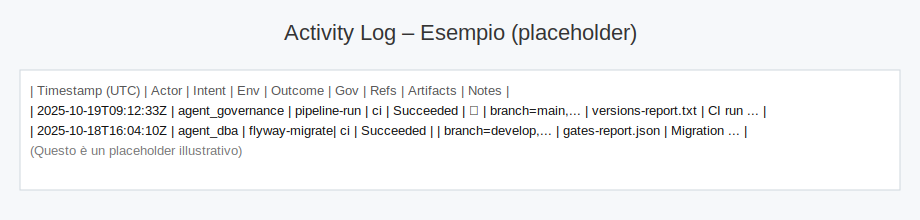

[Home](../../scripts/docs/project-root/DEVELOPER_START_HERE.md) >  > 

## Obiettivo
- Descrivere come eseguire il deploy dell’API EasyWay su Azure App Service usando la pipeline ADO, con variabili/toggle e mapping App Settings.

## Domande a cui risponde
- Quali variabili devo impostare per abilitare un deploy in pipeline?
- Come deployo su uno slot e quando conviene fare lo swap verso production?
- Quali gate vengono eseguiti prima del deploy e come li controllo via toggle?
- Da dove arrivano gli App Settings e come gestisco i segreti (Variable Group/Key Vault)?
- Come verifico rapidamente post-deploy (portal/API docs) e dove guardo log/artifact in caso di errore?

## Prerequisiti
- Azure DevOps con Service Connection (Azure Resource Manager) → `AZURE_SERVICE_CONNECTION`
- Risorse Azure: Resource Group, App Service (Web App), opzionale Slot (es. `staging`)
- Variable Group con segreti/env applicativi (Auth/DB/Storage/Branding/OTel)

## Passi

Pipeline – Stages (ordine)
1. Infra (Terraform plan/apply)
2. DB (Flyway validate/migrate) – condizionato da `FLYWAY_ENABLED`
3. BuildAndTest
   - Versions Report (artifact `versions-report.txt`)
   - NodeBuild (build/lint/test; publish artifact `api-dist`)
   - Gates: Pre‑Deploy Checklist, KB Consistency, DB Drift
   - Activity Log + Gates Report (artifact `gates-report.json`)
4. Deploy (App Service) – condizionato da `ENABLE_DEPLOY`

Variabili – Toggle & Versioni
- Toggle gates/job:
  - `ENABLE_CHECKLIST` (default `true`)
  - `ENABLE_DB_DRIFT` (default `true`)
  - `ENABLE_KB_CONSISTENCY` (default `true`)
  - `FLYWAY_ENABLED` (default `false`)
  - `ENABLE_DEPLOY` (default `false`)
  - `ENABLE_SWAP` (default `false`) – esegue lo swap di slot post‑deploy
- Versioni (template `ci/versions.yml`):
  - `node_version` (default `22.x`)
  - `flyway_version` (default `9.22.3`)
  - `terraform_version` (default `1.9.5`)

Variabili – Deploy
- Obbligatorie:
  - `AZURE_SERVICE_CONNECTION` – Service Connection (Azure RM)
  - `WEBAPP_NAME` – nome Web App
  - `RESOURCE_GROUP` – Resource Group della Web App
- Opzionale:
  - `WEBAPP_SLOT` – nome slot (es. `staging`); se impostato, il deploy avviene sullo slot

App Settings (mapping)
- Vengono applicati dalla pipeline (task AzureAppServiceSettings@1):
  - Auth/JWT: `AUTH_ISSUER`, `AUTH_JWKS_URI`, `AUTH_AUDIENCE`, `AUTH_CLIENT_ID`, `AUTH_TENANT_ID`, `TENANT_CLAIM`, `AUTH_SCOPES`
  - DB: `DB_CONN_STRING` (oppure AAD variabili alternative)
  - Storage: `AZURE_STORAGE_CONNECTION_STRING`, `AZURE_STORAGE_ACCOUNT`
  - Branding: `BRANDING_CONTAINER`, `BRANDING_PREFIX`, `DEFAULT_TENANT_ID`
  - RLS/Log/Portal: `RLS_CONTEXT_ENABLED`, `LOG_LEVEL`, `LOG_DIR`, `PORTAL_BASE_PATH`
  - Rate limit/body: `RATE_LIMIT_WINDOW_MS`, `RATE_LIMIT_MAX`, `BODY_LIMIT`
  - Observability: `APPLICATIONINSIGHTS_CONNECTION_STRING`, `OTEL_ENABLED`, `OTEL_TRACES_SAMPLER`, `OTEL_TRACES_SAMPLER_ARG`

Procedura – Deploy su slot + swap (opzionale)
1. Imposta variabili: `ENABLE_DEPLOY=true`, `AZURE_SERVICE_CONNECTION`, `WEBAPP_NAME`, `RESOURCE_GROUP`, `WEBAPP_SLOT=staging`
2. (Opzionale) `ENABLE_SWAP=true` per eseguire lo swap `staging → production` post‑deploy
3. Avvia la pipeline; verifica l’esito del job Deploy e (se attivo) dello swap

## Verify

Verifica post‑Deploy
- `https://<webapp>.azurewebsites.net/portal` → mini‑portale
- `https://<webapp>.azurewebsites.net/api/docs` → documentazione API (OpenAPI)
- In caso di slot: testare lo slot prima dello swap (`https://<webapp>-staging.azurewebsites.net/...`)

Sicurezza & Governance
- App Settings provengono da Variable Group/Key Vault; non inserire segreti in YAML
- Branch protection + approvazioni per abilitare `ENABLE_DEPLOY`/`ENABLE_SWAP` in ambienti critici
- Gates (Checklist/Drift/KB) come prerequisiti qualitativi
- Guardrail Sync App Settings: il job di sincronizzazione da `.env.local` è condizionato da `ENABLE_SYNC_APPSETTINGS=true` e richiede `GOV_APPROVED=true` se il branch è `main` o l'ambiente è `prod` (variabili: `ENVIRONMENT`, `GOV_APPROVED`).
  - Nelle esecuzioni approvate comparirà un badge ✅ nella colonna "Gov" del diario di bordo (Wiki/EasyWayData.wiki/activity-log.md).

Esempio (screenshot)


Troubleshooting
- Logs App Service (Kudu), Application Insights (se configurato), artifact `versions-report.txt`
- Riferimenti: `agents/kb/recipes.jsonl` (ricette deploy, slot/swap, toggle)

Esempio App Settings (starter JSON)
Puoi incollare questo JSON (adattando i valori) nel task AzureAppServiceSettings@1 o usarlo come riferimento per configurare manualmente gli App Settings nel portale Azure.

```sql
[
  {"name":"AUTH_ISSUER","value":"https://login.microsoftonline.com/<TENANT_ID>/v2.0","slotSetting":false},
  {"name":"AUTH_JWKS_URI","value":"https://login.microsoftonline.com/<TENANT_ID>/discovery/v2.0/keys","slotSetting":false},
  {"name":"AUTH_AUDIENCE","value":"api://your-app-id","slotSetting":false},
  {"name":"AUTH_CLIENT_ID","value":"<CLIENT_ID>","slotSetting":false},
  {"name":"AUTH_TENANT_ID","value":"<TENANT_ID>","slotSetting":false},
  {"name":"TENANT_CLAIM","value":"ew_tenant_id","slotSetting":false},
  {"name":"AUTH_SCOPES","value":"api://default/.default","slotSetting":false},

  {"name":"DB_CONN_STRING","value":"Server=tcp:<sql-host>,1433;Database=<db>;User Id=<user>;Password=<pwd>;Encrypt=true","slotSetting":false},

  {"name":"AZURE_STORAGE_CONNECTION_STRING","value":"<conn-string-o-NULL-se-MI>","slotSetting":false},
  {"name":"AZURE_STORAGE_ACCOUNT","value":"<account-name>","slotSetting":false},

  {"name":"BRANDING_CONTAINER","value":"portal-assets","slotSetting":false},
  {"name":"BRANDING_PREFIX","value":"config","slotSetting":false},
  {"name":"DEFAULT_TENANT_ID","value":"tenant01","slotSetting":false},

  {"name":"RLS_CONTEXT_ENABLED","value":"true","slotSetting":false},
  {"name":"LOG_LEVEL","value":"info","slotSetting":false},
  {"name":"LOG_DIR","value":"logs","slotSetting":false},
  {"name":"PORTAL_BASE_PATH","value":"/portal","slotSetting":false},
  {"name":"RATE_LIMIT_WINDOW_MS","value":"60000","slotSetting":false},
  {"name":"RATE_LIMIT_MAX","value":"600","slotSetting":false},
  {"name":"BODY_LIMIT","value":"1mb","slotSetting":false},

  {"name":"APPLICATIONINSIGHTS_CONNECTION_STRING","value":"<AI connection string>","slotSetting":false},
  {"name":"OTEL_ENABLED","value":"true","slotSetting":false},
  {"name":"OTEL_TRACES_SAMPLER","value":"parentbased_always_on","slotSetting":false},
  {"name":"OTEL_TRACES_SAMPLER_ARG","value":"","slotSetting":false}
]
```sql

Snippet alternativi (riuso rapido)
- Formato CLI (az webapp config appsettings set --settings @appsettings.cli.json)
```sql
{
  "AUTH_ISSUER": "https://login.microsoftonline.com/<TENANT_ID>/v2.0",
  "AUTH_JWKS_URI": "https://login.microsoftonline.com/<TENANT_ID>/discovery/v2.0/keys",
  "AUTH_AUDIENCE": "api://your-app-id",
  "AUTH_CLIENT_ID": "<CLIENT_ID>",
  "AUTH_TENANT_ID": "<TENANT_ID>",
  "TENANT_CLAIM": "ew_tenant_id",
  "AUTH_SCOPES": "api://default/.default",
  "DB_CONN_STRING": "Server=tcp:<sql-host>,1433;Database=<db>;User Id=<user>;Password=<pwd>;Encrypt=true",
  "AZURE_STORAGE_CONNECTION_STRING": "<conn-string>",
  "AZURE_STORAGE_ACCOUNT": "<account>",
  "BRANDING_CONTAINER": "portal-assets",
  "BRANDING_PREFIX": "config",
  "DEFAULT_TENANT_ID": "tenant01",
  "RLS_CONTEXT_ENABLED": "true",
  "LOG_LEVEL": "info",
  "LOG_DIR": "logs",
  "PORTAL_BASE_PATH": "/portal",
  "RATE_LIMIT_WINDOW_MS": "60000",
  "RATE_LIMIT_MAX": "600",
  "BODY_LIMIT": "1mb",
  "APPLICATIONINSIGHTS_CONNECTION_STRING": "<AI conn>",
  "OTEL_ENABLED": "true",
  "OTEL_TRACES_SAMPLER": "parentbased_always_on",
  "OTEL_TRACES_SAMPLER_ARG": ""
}
```sql

- Formato Task Azure DevOps (AzureAppServiceSettings@1) – appsettings.task.json
```sql
[
  {"name":"AUTH_ISSUER","value":"...","slotSetting":false},
  {"name":"AUTH_JWKS_URI","value":"...","slotSetting":false}
  // ... (vedi starter JSON sopra)
]
```sql


