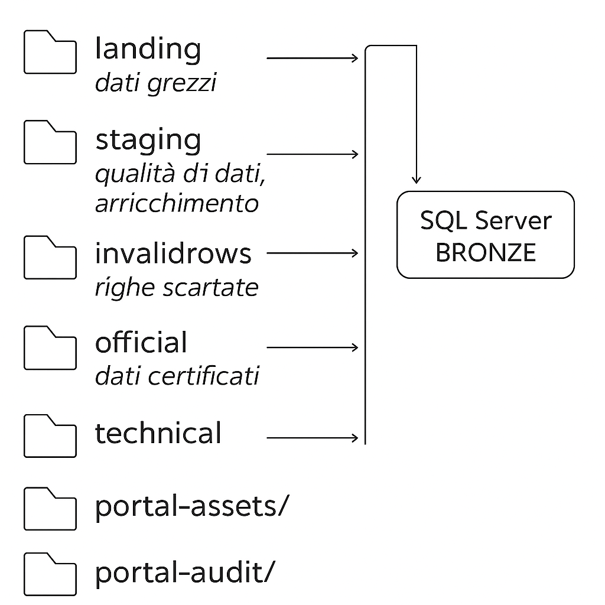

🎯 Obiettivo
------------

Garantire una gestione strutturata, sicura e scalabile dei dati attraverso lo **Storage Account Azure `ew-datalake-dev`**, rispettando:
*   Segregazione per tenant
*   Ciclo di vita completo dei dati (dal grezzo al certificato)
*   Tracciabilità degli errori e degli scarti
*   Monitoraggio dei costi e delle retention policy
*   Compliance normativa (GDPR, ISO27001, SOC2, DORA)





🏗️ Struttura Logica Datalake (per Tenant)

```sql
ew-datalake-dev/
├── tenant-xxxx/
│   ├── landing/       # Raw, file ricevuti così come sono
│   ├── staging/       # Lavorazione tecnica, data quality, arricchimento
│   ├── official/      # Dati certificati, validati, pronti per DB
│   ├── invalidrows/   # Scarti, righe non conformi con motivazione tecnica
│   └── technical/     # Logs ETL, diagnostica, file temporanei
├── portal-assets/     # Risorse del Portale (loghi, template, colori)
│   ├── logos/
│   ├── color-schemes/
│   ├── templates/
│   └── icons/
├── portal-audit/      # Audit & Security Logs
│   ├── db-audit-logs/
│   ├── storage-audit-logs/
│   ├── etl-execution-logs/
│   └── security-events/
```sql

🔄 Flusso Dati Operativo
----------------------------------------

```sql
landing/    → staging/ (arricchimento, DQ)
                ↓
           invalidrows/ (se KO)
                ↓
           official/ (se OK)
                ↓
        SQL Server (BRONZE / SILVER / GOLD)
```sql

📂 Dettaglio delle Directory
----------------------------

### `landing/`

*   File originali grezzi (CSV, JSON, XML)
*   Ricevuti da sistemi esterni (Amazon, Shopify, ecc.)
*   Nessuna trasformazione
*   Solo per tracciabilità e audit

### `staging/`

*   Copia da `landing/`
*   Arricchimento tecnico: colonne di competenza, source system, tenant, ecc.
*   Regole di **Data Quality**
*   Flag `esito_dq = OK / BLOCKED`
*   Non si prosegue verso `official/` in presenza di `BLOCKED`

### `invalidrows/`

*   Contiene file scartati da `staging/`
*   Evidenzia righe che non superano le regole di qualità (es. CF mancante)
*   File esempi:
```sql
invalidrows/2024-07-19/
├── rejected_rows.csv
├── dq_report.txt
├── log.json
```sql

Facilita audit, troubleshooting e trasparenza verso clienti o vendor

official/
*   Solo dati **certificati, validati, completi**
*   Pronti per ingestion in SQL Server (BRONZE)
*   Non contiene errori, non contiene scarti
    
* * *

### `technical/`

*   Logs ETL, diagnostica tecnica, file temporanei operativi
    
*   Scarti temporanei, export tecnici di processo

### `portal-assets/`

*   Risorse statiche del Portale:
    *   Loghi
    *   Template
    *   Palette colori
    *   Icone
        
*   Nessuna policy di retention automatica

### `portal-audit/`

*   Audit Database (PORTAL / BRONZE / SILVER / GOLD)
*   Audit Storage (Access logs, ACL changes)
*   Log ETL (ADF, Databricks, Synapse)
*   Security Events (SIEM, Sentinel, Defender)
*   Retention minima **36 mesi**


📊 Retention Policy (Blob Lifecycle Management)
----------------------------------------
| Directory | Retention | Motivazione |
| --- | --- | --- |
| `landing/` | **180 giorni** | Dati grezzi, utili solo a breve |
| `staging/` | **360 giorni** | Lavorazione tecnica temporanea |
| `official/` | Nessuna | Master dataset |
| `invalidrows/` | **360 giorni** | Audit e diagnosi |
| `technical/` | **360 giorni** | Logs ETL, scarti temporanei |
| `portal-assets/` | Nessuna | Gestione manuale asset del portale |
| `portal-audit/` | **36 mesi min.** | Audit e compliance (ISO, DORA) |

💰 Monitoraggio Costi e Consumi
----------------------------------------
| Strumento | Scopo |
| --- | --- |
| **Azure Cost Management** | Monitoraggio spesa mensile |
| **Storage Metrics** | Visualizzazione uso per container |
| **Blob Inventory** | Analisi quantità e tipo file |
| **Azure Monitor Alerts** | Alert soglie costi e volumi |

Esempi di Alert
| Condizione | Soglia | Azione |
| --- | --- | --- |
| Storage > 80% budget | 80% | Alert IT Governance |
| Container `landing/` > 2 TB | 2 TB | Verifica cleanup |

🔎 Audit & Compliance (Database & Storage)
----------------------------------------
### Audit Database attivo su:

*   PORTAL / BRONZE / SILVER / GOLD
    
*   Azioni tracciate: SELECT, INSERT, UPDATE, DELETE
    
*   Eventi critici: DATABASE_OBJECT_PERMISSION_CHANGE, ROLE_MEMBER_CHANGE


Audit Storage:
```sql
portal-audit/
├── db-audit-logs/
├── storage-audit-logs/
├── etl-execution-logs/
├── security-events/
```sql

✅ Best Practice Operative - Checklist IT
----------------------------------------

*   Retention policy attiva su ogni area tecnica
*   Monitoraggio costi trimestrale tramite Azure Cost Management
*   Alert configurati su soglie volumi e spesa
*   Audit logs archiviati minimo 36 mesi
*   Revisione annuale ACL / RBAC su tenant e storage
*   Tracciamento accessi DB e storage (compliance)

🚀 Stato attuale: COMPLETO E SOSTENIBILE
----------------------------------------
| Aspetto | Stato |
| --- | --- |
| Sicurezza | ✅ |
| Segregazione Tenant | ✅ |
| Data Lifecycle | ✅ |
| Cost Management | ✅ |
| Retention Policy | ✅ |
| Audit / Compliance | ✅ |


?? Provisioning con Terraform
----------------------------------------
Il layout dello Storage (ADLS Gen2) può essere creato via Terraform (vedi `infra/terraform`):

- Storage Account con HNS attivo
- Filesystem `datalake` e `portal-assets`
- Directory per tenant: `tenant-xxxx/{landing,staging,official,invalidrows,technical}`
- Directory `portal-assets/config/` per i file YAML di branding

Output Terraform → variabili API:
- `storage_connection_string` → `AZURE_STORAGE_CONNECTION_STRING`
- `branding_container_name` → `BRANDING_CONTAINER` (tipicamente `portal-assets`)
- `branding_prefix` → `BRANDING_PREFIX` (default `config`)

Esempio comandi:
```sql
cd infra/terraform
terraform init
terraform plan -var "project_name=easyway" -var "resource_group_name=rg-easyway-dev" -var "storage_account_name=ewdlkdev123" -var "tenants=[\"tenant01\"]"
terraform apply
```sql

Integra poi gli output in Azure DevOps (Variable Group) o Key Vault.

## Domande a cui risponde
- Cosa fa questa pagina?
- Quali sono i prerequisiti?
- Quali passi devo seguire?
- Quali sono gli errori comuni?
- Dove approfondire?


