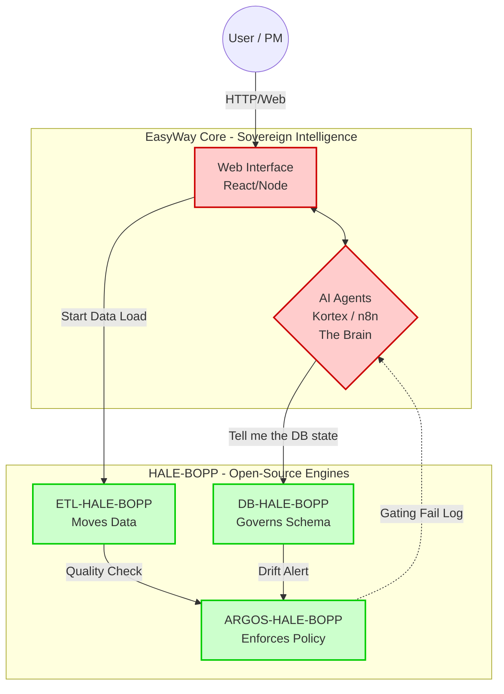

# HALE-BOPP — Strategy & Architecture

## Questions answered
- Why separate AI intelligence from deterministic execution?
- What is the "Brain vs Muscles" paradigm?
- How do EasyWay and HALE-BOPP interact in production?
- What is the development workflow across both repositories?

## The "Brain vs Muscles" Paradigm

The EasyWay + HALE-BOPP ecosystem is built on a strict separation between **intelligent reasoning** and **deterministic execution**.

### The Brain — EasyWay Core (Private)
- **Nature**: Proprietary, closed-source — the competitive advantage
- **Contains**: Web UI, 50+ AI agents (Kortex/Valentino), n8n workflows, RAG knowledge base
- **Role**: Reasons, decides, communicates with humans. Owns intelligence, secrets, business knowledge
- **Uses HALE-BOPP as**: External muscles for heavy physical work

### The Muscles — HALE-BOPP (Open-Source)
- **Nature**: Public, MIT-licensed — a gift to the tech community
- **Contains**: ETL orchestration, schema governance, policy gating
- **Role**: Executes blindly but infallibly. No AI, no intelligence — pure deterministic mechanics
- **Any company** can download from GitHub to replace legacy engines (Flyway, custom ETL, manual governance)

## Production Architecture

## Interaction Dynamics

1. **Engine humility**: ETL and ARGOS work in the dark. When something breaks (DB drift, pipeline failure), ARGOS emits a JSON event to a log and stops. It does not know how to notify a human — it is just a "muscle".

2. **Agent sensitivity**: In the EasyWay container, `agent_dba` constantly listens (polling or webhook) for HALE-BOPP events. When it sees "Drift detected on table Users", the agent wakes up, analyzes the anomaly with its LLM, and writes to Slack/Teams: *"Operator Marco manually modified a column, HALE-BOPP intercepted it. Should I open an issue for rollback or force automatic alignment?"*

## Development Workflow

1. **Develop** new API/logic in `C:\old\HALE-BOPP\<module>`. Run tests locally (`docker-compose up`)
2. **Commit** to the public HALE-BOPP repository on GitHub
3. **Teach agents**: Return to EasyWay, update the relevant agent (e.g., `agent_dba`) to call the new HALE-BOPP APIs
4. **Commit** to the private EasyWay repository on Azure DevOps

This separation ensures:
- AI agents never attempt SQL hash calculations
- Deterministic parsers never get polluted with GPT logic
- Development proceeds in watertight compartments
