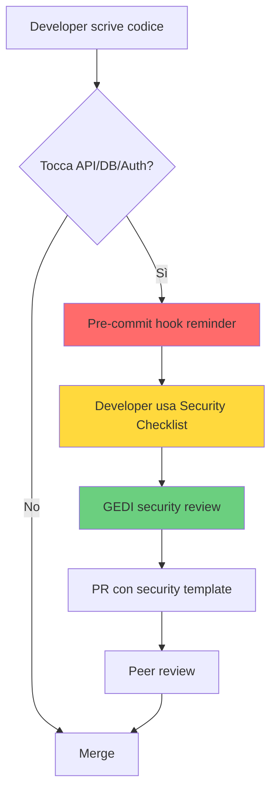

[[../start-here.md|Home]] > Security Index

# 🛡️ Security - La Bibbia

> **"Formazione a testuggine come un solo uomo!"** - Massimo Decimo Meridio  
> **"La vittoria si ottiene prima della battaglia"** - Sun Tzu

Documentazione completa di sicurezza EasyWayDataPortal.

---

## 📚 Indice Generale

### 🔴 Per Sviluppatori (Security by Design)

| Documento | Quando usare | Tempo lettura |
|-----------|--------------|---------------|
| **[Security Dev Checklist](./security/index.md)** | Ogni nuova feature con API/DB/Auth | 5 min |
| **[Quick Reference Card](./security/index.md)** | Promemoria rapido (stampare!) | 30 sec |
| **[AI Security Guardrails](../../../scripts/docs/agentic/ai-security-guardrails.md)** | Feature con agenti AI | 10 min |

### 🟠 Per Operations & Admin

| Documento | Quando usare | Tempo lettura |
|-----------|--------------|---------------|
| **[Security Framework (RBAC)](./security/threat-analysis-hardening.md)** | Setup server, gestione utenti | 15 min |
| **[Threat Analysis & Hardening](./threat-analysis-hardening.md)** | Implementare difese server | 15 min |
| **[Segreti e Accessi](./segreti-e-accessi.md)** | Gestione credenziali, KeyVault | 5 min |
| **[Agent Security (IAM)](../../../scripts/Wiki/EasyWayData.wiki/security/agent-security-iam.md)** | Configurare agenti con KeyVault | 5 min |

### 🟡 Per Security Team & Audit

| Documento | Quando usare | Tempo lettura |
|-----------|--------------|---------------|
| **[Security Audit (ewctl)](./security/threat-analysis-hardening.md)** | Audit command injection protection | 5 min |
| **[Operatività Governance](./operativita-governance-provisioning-accessi.md)** | Provisioning accessi governance-driven | 5 min |

### 🎮 Roadmap & Planning

| Documento | Quando usare | Tempo lettura |
|-----------|--------------|---------------|
| **[War Game Roadmap](./wargame-roadmap.md)** | Pianificare penetration test futuro | 10 min |

---

## 🎯 Quick Navigation - Per Caso d'Uso

### "Sto sviluppando una nuova API"
1. ✅ Leggi: [Security Dev Checklist](./security/index.md)
2. ✅ Verifica: Input validation, RBAC, SQL injection protection
3. ✅ Chiedi review: `agent-gedi.ps1 -Intent "security_review"`
4. ✅ Usa: PR template con security checklist

### "Sto configurando un nuovo server"
1. ✅ Leggi: [Security Framework (RBAC)](./security/threat-analysis-hardening.md)
2. ✅ Applica: 4-tier RBAC (read/ops/dev/admin)
3. ✅ Implementa: [Threat Analysis - Contromisure Critiche](./threat-analysis-hardening.md)
4. ✅ Verifica: Tutti i check completati

### "Devo gestire secrets/credenziali"
1. ✅ Leggi: [Segreti e Accessi](./segreti-e-accessi.md)
2. ✅ Usa: Azure Key Vault (mai hardcoded!)
3. ✅ Documenta: Access registry (chi ha accesso a cosa)

### "Sto creando un agent AI"
1. ✅ Leggi: [AI Security Guardrails](../../../scripts/docs/agentic/ai-security-guardrails.md)
2. ✅ Implementa: Input/output validation
3. ✅ Testa: Prompt injection resistance
4. ✅ Verifica: [Agent Security (IAM)](../../../scripts/Wiki/EasyWayData.wiki/security/agent-security-iam.md) per KeyVault

### "Voglio fare penetration test"
1. ✅ Leggi: [War Game Roadmap](./wargame-roadmap.md)
2. ⏸️ Aspetta: Prima implementa tutte le difese
3. ✅ Poi: Esegui Red Team vs Blue Team

---

## 🛡️ Filosofie di Sicurezza (GEDI Principles)

### 1. Testudo Formation (Massimo Decimo Meridio)
**Difesa coordinata > eroi individuali**

Ogni componente (RLS, RBAC, fail2ban, AI Guardrails) è uno scudo. Solo insieme formano barriera impenetrabile.

**Check**: Gli scudi si toccano? C'è un punto debole?

### 2. Victory Before Battle (Sun Tzu)
**Security by design > remediation dopo attacco**

Costruire difese MENTRE sviluppi, non dopo essere stato attaccato.

**Check**: Security è afterthought o parte del definition of done?

### 3. Black Swan Resilience (Nassim Taleb)
**Sistema resiliente assorbe l'impatto, non frantuma**

Defense in depth, graceful degradation, nessun single point of failure.

**Check**: Se questa difesa viene bypassata, sistema collassa o degrada?

---

## 📊 Security Maturity Model

### Current State (2026-01-26)

| Area | Livello | Status |
|------|---------|--------|
| **Documentation** | ⭐⭐⭐⭐⭐ | Completa e strutturata |
| **Development Process** | ⭐⭐⭐⭐ | Checklist + hooks integrati |
| **Server Hardening** | ⭐⭐⭐ | Pianificato, da implementare |
| **AI Security** | ⭐⭐⭐⭐ | Layer 4 attivo, 1-3-5 documentati |
| **Testing** | ⭐⭐ | War game pianificato per futuro |

**Next Steps**:
1. 🔴 Implementare 4 contromisure critiche (RLS, SSH, fail2ban, AI Guardrails)
2. 🟠 Server hardening completo
3. 🟡 War game execution

---

## 🔄 Security Workflow



---

## 📋 Checklist Pre-Production

Prima di andare in produzione, verifica:

### Database
- [ ] RLS attiva e testata
- [ ] Tutte le query usano stored procedures
- [ ] Secrets in KeyVault (no hardcoded)
- [ ] Backup e recovery testati

### Server
- [ ] RBAC 4-tier configurato
- [ ] SSH hardening (solo chiavi)
- [ ] fail2ban attivo
- [ ] Firewall configurato
- [ ] Logs immutabili (chattr +a)

### Application
- [ ] Input validation su tutti gli endpoint
- [ ] RBAC/Authorization verificata
- [ ] Error handling user-friendly (no stack trace)
- [ ] Security events loggati

### AI Agents
- [ ] AI Guardrails integrati (input/output validation)
- [ ] Agent allowlist configurata
- [ ] Egress filtering attivo
- [ ] KB integrity pre-commit hook

### Monitoring
- [ ] Log aggregation attivo
- [ ] Alert su eventi security
- [ ] Dashboard monitoring disponibile

---

## 🤖 GEDI Integration

**Agent GEDI** è il custode dei principi di security.

### Come usare GEDI per security review

```powershell
# Review security di una feature
.\agents\agent_gedi\agent-gedi.ps1 `
    -Context "Nuova API /users con endpoint DELETE" `
    -Intent "security_review"
```

**GEDI verificherà**:
- ✅ `testudo_formation`: Difese coordinate?
- ✅ `victory_before_battle`: Security by design?
- ✅ `black_swan_resilience`: Sistema resiliente?

Vedi: [`agent_gedi/manifest.json`](./agents/gedi/manifest.json) - Principi filosofici completi

---

## 📚 Riferimenti Esterni

### Best Practices
- [OWASP Top 10](https://owasp.org/www-project-top-ten/)
- [NIST Cybersecurity Framework](https://www.nist.gov/cyberframework)
- [CIS Controls](https://www.cisecurity.org/controls)

### Compliance
- ISO 27001 - Information Security Management
- SOC 2 - Security & Availability
- GDPR - Data Protection (per dati EU)

---

## 🆘 Security Incident Response

In caso di security incident:

1. **Contenimento**: Isola sistema compromesso
2. **Notifica**: Alert team-platform immediatamente
3. **Analisi**: Revisa logs (`/var/log/easyway/`, `agents/logs/security-events.jsonl`)
4. **Remediation**: Applica fix da [Threat Analysis](./threat-analysis-hardening.md)
5. **Post-mortem**: Documenta lesson learned
6. **Update**: Aggiorna security checklist se necessario

---

## 📞 Contatti

- **Security Owner**: team-platform
- **GEDI Questions**: `agent-gedi.ps1`
- **Escalation**: Vedi `ESCALATION.md` (se esiste)

---

**Ultimo aggiornamento**: 2026-01-26  
**Prossima review**: Quarterly (ogni 3 mesi)  
**Maintainer**: Giuseppe Belviglio + Agent GEDI

---

*"Formazione a testuggine come un solo uomo!"* 🛡️


